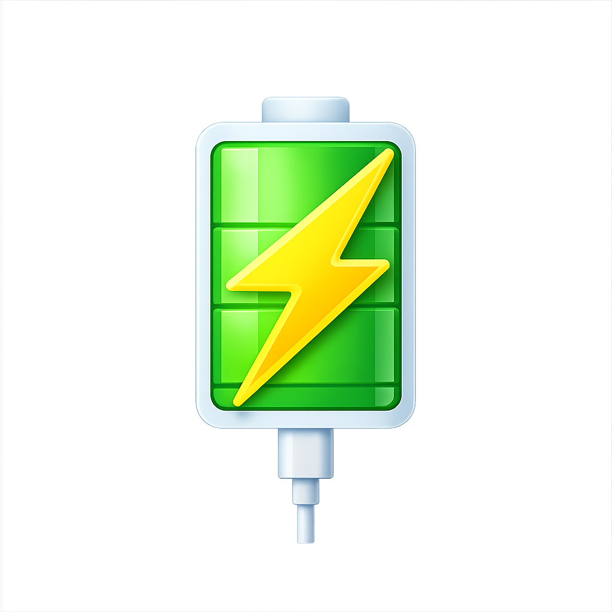
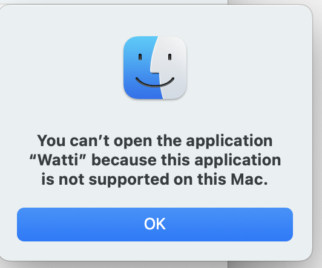

# Watti

## Why

I built Watti because my super old mac’s battery is in terrible shape. I need to know often how many watts I am getting from a certain charger. My battery will puke even on the best chargers, but I want to know still what my current input is.

I found a cool api surfaced by Apple that allows you to get the familyCode of a charger, so we can name chargers.

For other old mac users, you will likely appreciate the TTL concept, ie, if unplugged now, how long your computer will last before blacking out.

I thought I would share with others who might be having the same issue as I am. But the expectation is that no one will find or use this. I may resort to just installing this on my friend’s machines. ;)

Ping me with questions —

Happy hacking,

Reif  
reif@thegoodproject.net

## What each part does

### Menu bar

- **Lightning icon** — Uses the system SF Symbol. When monitoring is on and you are on **AC**, the bolt is tinted **green**. On battery (or when monitoring is off), it uses the neutral template style so it matches the menu bar.
- **Watt readout (e.g. `+60.9W` or `-26.4W`)** — **`+`** means net power coming **in** from the wall path (what Watti could measure or infer for “external” power). **`-`** means you are drawing from the **battery** (discharge). The value is refreshed on a timer (see **Refresh** below). If you turn monitoring off, the title shows **`off`** instead of a live number.
- **Tooltip** — When monitoring is on, hover shows a short **subtitle** (e.g. “Receiving External Power” / “Running on Battery”) and **caption** describing which telemetry path produced the headline watts (live input, adapter report, smoothed average, etc.).
- **Click** — **Left click** toggles the popover panel. **Right click** or **Control‑click** opens the **context menu** (see below).

### Main panel (popover)

Top to bottom:

- **“Watti” wordmark** — Branding only. When macOS reports the battery as **charging**, the mark gets a soft **pulsing glow** so you can see “energy is moving” at a glance.
- **Close (X)** — Dismisses the popover. The app keeps running in the menu bar.
- **Large watt number (e.g. `+60.9 W` / `-26.4 W`)** — Same meaning as the menu bar readout, with a **rolling** animation so small changes do not flicker. Separator line under it divides “headline” from detail rows.
- **Current Charger** — The **value** is the **nickname you saved** for this *charger setup* (see **Charger identity**). If you have not named it yet, on wall power it shows **Charger Setup**; on battery only it shows **Battery Power**. “Setup” here means the combination of adapter identity signals Watti can see (rated watts, negotiation, description, Apple **familyCode**, etc.), not just the cable shape.
- **Power Source** — Plain‑language state plus **State of Charge** when available, for example **AC Charger · 73% battery**, **Battery · 74% battery**, or **AC + Battery · …** when the Mac is on AC but the **battery is assisting** under heavy load (`battery_assist` in the app).
- **If Unplugged Now** *(title on AC)* / **Battery Life** *(title on battery)* — The **label** switches so it matches what you are looking at: on normal AC it asks the **“unplug now”** question; on battery it reads **Battery Life**. The **value** is a **duration** (`0h 40m` style) when Watti can compute it: it prefers a **TTL‑style estimate** using **remaining energy in the battery (Wh)** divided by a **rolling average of recent power draw** (so it reacts to how you have actually been using the machine). If macOS exposes a time‑to‑empty value, that can feed the same cell when the app’s estimate is not available. **`--`** means not enough data yet.
- **Time to Full** — Estimates how long until **full** from macOS **time‑to‑full** data when present; otherwise may show **Charging**, **Not Charging**, **Full**, or **`--`** depending on AC/battery/charge state.
- **Charger Profile** — Summarizes what the adapter negotiation / nameplate says: typically **`NN W rated`** from the brick and **`M.M W max`** from USB‑PD / port controller info. If those are missing but **measured input watts** exist, you may see **`NN.N W live`** instead. **`--`** if nothing useful was returned.
- **Settings (gear)** — Opens the **Settings** sheet (see below). The popover also **auto‑closes after ~30s** if left open, to avoid cluttering the screen.

### Settings

- **Back** (‹) returns from Settings to the main panel; **X** closes the whole popover.
- **About** — Short credit line for **The Good Project** / public domain (**UNLICENSE**).
- **Legal & disclaimer** — One‑shot modal with the as‑is / not‑engineering‑advice language.
- **Open at login** — Toggles the app in your **user Login Items** (same idea as System Settings → General → Login Items). Watti needs a normal app install (e.g. under **Applications**) for macOS to allow the toggle; otherwise you get an error telling you to add it manually.
- **Stop Monitoring / Start Monitoring** — Pauses or resumes the **2s refresh timer** and related sampling. While stopped, the menu bar can show **`off`** and the popover’s **Power Source** line shows **Monitoring Paused**.
- **Visit thegoodproject.net** / **Email reif@thegoodproject.net** — Opens the site or your mail client.
- **Quit Watti** — Terminates the app.

### Context menu (right‑click or Control‑click the menu bar item)

- **Summary line** (dimmed) — Quick read of **watts** and the same **subtitle** string used in the tooltip.
- **Show Panel / Hide Panel** — Same as left‑click toggle.
- **Pause Monitoring / Resume Monitoring** — Same as the Settings button.
- **Refresh Now** — Forces an immediate telemetry pass (menu shortcut **⌘R**).
- **Open Logs** — Reveals **`watti.log`** in Finder (**⌘L**).
- **Quit Watti** — Same as Settings (**⌘Q**).

### Charger identity and naming

When you plug in a combination Watti has **not** seen before, it can show **Name This Charger Setup?** You can save a **nickname**; that string is stored under **`~/Library/Application Support/Watti/charger-names.plist`**, keyed by a **fingerprint** derived from stable adapter fields (including **familyCode** and rated/negotiated power). Next time that setup appears, **Current Charger** shows your name automatically.

### Logs

Watti appends structured lines to **`~/Library/Logs/Watti/watti.log`** (creating the folder if needed). **`Open Logs`** selects that file in Finder so you can attach it when debugging or email questions.

### Refresh and lifecycle

- **Every 2 seconds** while **monitoring** is on, Watti pulls power/battery telemetry and recomputes the UI.
- **Sleep / wake** — On wake, it takes a fresh reading if monitoring is enabled.
- **Legacy folders** — If you ran an older build that used **`WattNote`** paths under Library, Watti **migrates** charger names and log directories into the **`Watti`** locations when it can.

---

**Watti** is a macOS menu bar app: live input watts, charger names you save, and unplugged runtime (TTL) when you are on battery.




Sponsored by **The Good Project** — contact `reif@thegoodproject.net`.

## Install (no Terminal)

### Recommended (drag‑drop)

1. Download **`Watti.dmg`** from [Releases](https://github.com/reif-is-a-foofie/Watti/releases).
2. Double‑click it to open.
3. Drag **`Watti.app`** onto **Applications** in the window that appears.
4. Open Watti from Applications the first time.

If macOS blocks it, go to **System Settings → Privacy & Security** and click **Open Anyway**.



### Alternative (archive)

1. Download **`Watti-macos.tar.gz`** — direct link to the latest release asset:  
   https://github.com/reif-is-a-foofie/Watti/releases/latest/download/Watti-macos.tar.gz  
   (If that 404s, open [Releases](https://github.com/reif-is-a-foofie/Watti/releases) and download `Watti-macos.tar.gz` from the newest version — the link works once a release includes that file.)
2. Double-click the archive; macOS unpacks it beside the download.
3. Drag **`Watti.app`** into **Applications**.
4. Open it from Applications the first time (right-click → **Open** if Gatekeeper complains about an unsigned download).

A `.zip` of the same app is also attached to each release if you prefer that format.

## Local build

```bash
./scripts/make_icon.sh
./build.sh
open build/Watti.app
```

## GitHub Releases (macOS)

Push a tag like `v1.0.0` and GitHub Actions will attach **`Watti-macos.tar.gz`** and **`Watti-macos.zip`** to the release.

